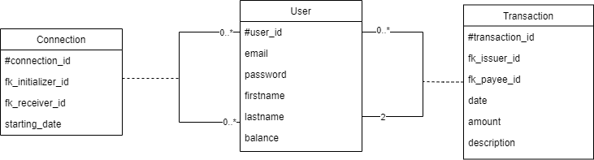
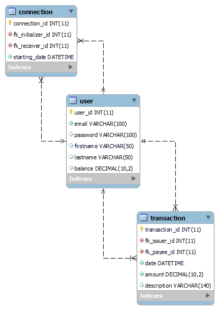

# PayMyBuddy
6th project from OpenClassrooms' Backend developer curriculum, an app for money transfer between friends.

## Summary

You are looking for an app that makes money transfer between friends? Say no more, you stumbled on the right application.

With PayMyBuddy, you will be able to:
- create an account,
- deposit or withdraw money at any time to your account,
- add new connections with only their email address and,
- transfer money to your dearest friends!
## Getting started

### What you need
- Java JDK 17.0.1
- SpringBoot 2.7.1
- Spring Security 5.7.2
- Maven 3.8.4
- Thymeleaf
- Bootstrap v.4.3.1

### Running PayMyBuddy
Clone the source repository using Git:

```git clone https://github.com/ernhollam/PayMyBuddy.git```

Open your favorite IDE, clone, and run `PayMyBuddyApplication.java` to launch the application.


## DAL layer
### UML diagram


### Physical data model


### Database
To create the database, open your favorite SGBD and run the script under [src/main/resources/database/create.sql](src/main/resources/database/create.sql).

Once your database is created, you can populate it by running [src/main/resources/database/data.sql](src/main/resources/database/data.sql) or by running the app, then creating your own users to test the app.


## Glimpses
We know, this is exciting! If you want to catch a glimpse at how PayMyBuddy looks, here are some shots of the most used pages!

Of course, to begin with, one must log in to appreciate all PayMyBuddy's features:


Once you are logged in, you are very well welcomed.


Want to add a connection, see last transactions or pay a buddy, the transfer page is here for you:

